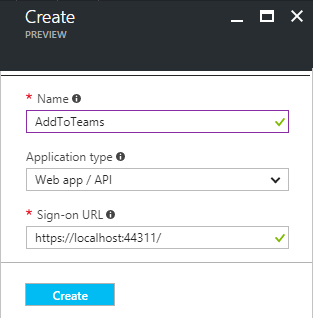
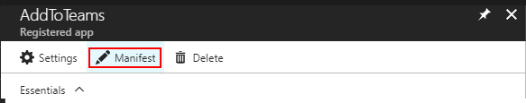
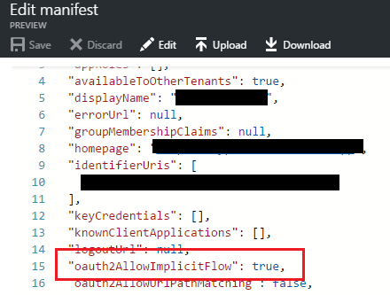
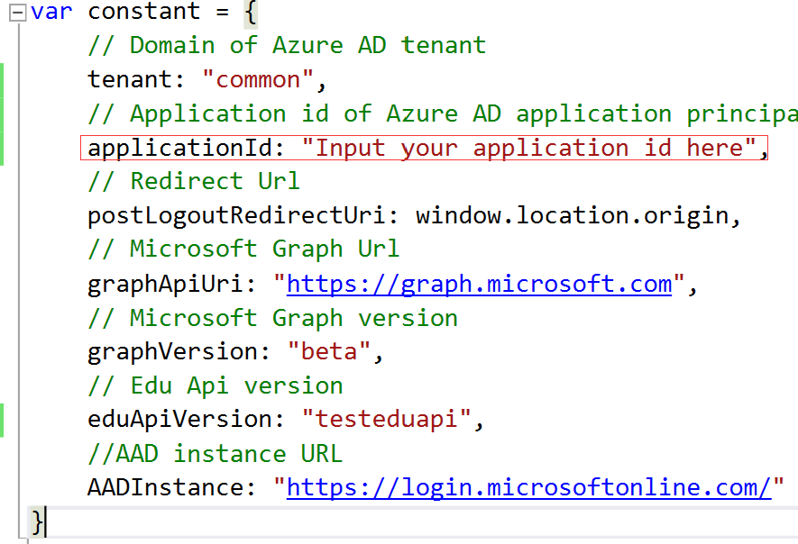
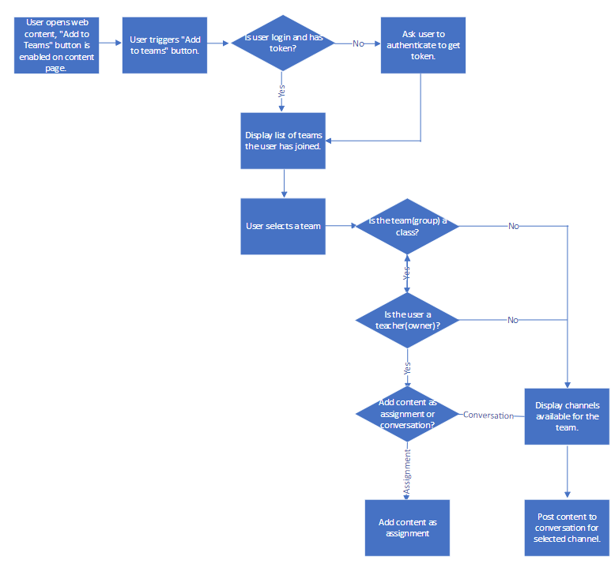

# Add to Teams Code Sample

In this sample we show you how to add announcements & assignments via the Graph API. 

**Table of contents**
* [Sample Goals](#sample-goals)
* [Prerequisites](#prerequisites)
* [Register the application in Azure Active Directory](#register-the-application-in-azure-active-directory)
* [Build and debug locally](#build-and-run-locally)
* [Understand the code](#understand-the-code)
* [Contributing](#contributing)

## Sample Goals

The sample demonstrates:

* Calling Graph APIs, including:

  * [EDUGraphAPIs - Assignments API](https://github.com/OfficeDev/O365-EDU-Tools/tree/master/EDUGraphAPIs/Assignments/api)
  * [Microsoft Graph API Group API](https://developer.microsoft.com/en-us/graph/docs/api-reference/v1.0/resources/group)

* [Admin consent](https://msdn.microsoft.com/en-us/skype/trusted-application-api/docs/tenantadminconsent) is also used in this project. 

## Prerequisites

**Deploying and running this sample requires**:
* An Azure subscription with permissions to register a new application, and deploy the web app.
* An O365 Education tenant with Microsoft School Data Sync enabled
    * One of the following browsers: Edge, Internet Explorer 9, Safari 5.0.6, Firefox 5, Chrome 13, or a later version of one of these browsers.
      Additionally: Developing/running this sample locally requires the following:  
    * Visual Studio 2015 (any edition), [Visual Studio 2015 Community](https://go.microsoft.com/fwlink/?LinkId=691978&clcid=0x409) is available for free.
    * Familiarity with C#, .NET Web applications, JavaScript programming and web services.

## Register the application in Azure Active Directory

1. Sign into the new azure portal: [https://portal.azure.com/](https://portal.azure.com/).

2. Choose your Azure AD tenant by selecting your account in the top right corner of the page:

   

3. Click **Azure Active Directory** -> **App registrations** -> **+Add**.

   

4. Input a **Name**, and select **Web app / API** as **Application Type**.

   Input **Sign-on URL**: https://localhost:44311/. This URL can be any port that make sense. 

   

   Click **Create**.

5. Once completed, the app will show in the list.

   

6. Click it to view its details. 

   

7. Click **All settings**, if the setting window did not show.

   * Click **Properties**, then set **Multi-tenanted** to **Yes**.

     

     Copy aside **Application ID**, then Click **Save**.

   * Click **Required permissions**. Add the following permissions:

     | API             | Application Permissions | Delegated Permissions                    |
     | --------------- | ----------------------- | ---------------------------------------- |
     | Microsoft Graph | N/A                     | Sign in and read user profile  Read all users' full profiles  Read and write all groups  Read a limited subset of users' view of the roster  Read users' view of the roster  Read users' class assignments without grades  Read users' class assignments and their grades  Read and write users' class assignments without grades   Read and write users' class assignments and their grades |

     

     ​

     ​

   * Click **Keys**, then add a new key:

     

     Click **Save**, then copy aside the **VALUE** of the key. 

   Close the Settings window.

8. Click **Manifest**.

   

   Change the value of the property **oauth2AllowImplicitFlow** to `true`. If the property is not present, add it and set its value to `true`.

   

   ​

   Click **Save**.

9. Click **Reply URLs**. Add **https://<yoursiteurl>**  and **https://<yoursiteurl>/views/sharetoteams.html** to it. Make sure replace <yoursiteurl> to the real URL.

   

   Click **Save**.

## Build and Run locally

This project can be opened with the edition of Visual Studio 2015 you already have, or download and install the Community edition to run, build and/or develop this application locally.

- [Visual Studio 2015 Community](https://go.microsoft.com/fwlink/?LinkId=691978&clcid=0x409)

Debug the **ShareToTeams**:

1. Open the project, and then edit **/scripts/constant.js**.

   

   - **clientId**: use the Client Id of the app registration you created earlier.
   - **tenant**: use your domain of Azure AD tenant.

2. Set **ShareToTeams** as Startup project, and press F5. 
3. Go to https://<your site URL>/consent.html. Click the **Consent** button to do admin consent. After consent succeed, a teacher/student can login to the demo site.
4. Go to https://<your site URL>, click the "Add to Teams" button on the page, a popup window will show and display groups/classes that current user joined. Select a group/class to add announcements or assignments.

## Understand the code

### Introduction

The demo is made by pure JavaScript.

[Active Directory Authentication Library for JavaScript](https://github.com/AzureAD/azure-activedirectory-library-for-js) (ADAL JS) helps you to use Azure AD for handling authentication in your applications.

### Basic flow:

### /scripts/constant.js

This file contains constant parameters like **clientId**, **teanant**, **graphApiUri**.

### /scripts/platform.js

This file creates "add to teams" icon on index.html.  A popup window will show after the icon is clicked.

### /scripts/consent.js

This file contains a button click event. After the button is clicked, it will redirect the user to Azure login page and then complete admin consent.  

**/scripts/sharetoteams.js**

This file contains most of functions to create an announcement and assignment to a class or channel.

Main functions:

| Function Name         | Description                              |
| --------------------- | ---------------------------------------- |
| getAccessToken        | If the user is not login, redirect to login page. Acquiring an Access Token if the user is login. |
| fetchUser             | Get current user, user photo, check user is teacher or not. |
| fetchTeams            | After user login, fetch user's joined teams. |
| onClassSelect         | Class/group select change event. And also check if a group is a class. |
| onActionSelect        | Action change event. Get channels and display on the page. |
| postAssignment        | Post an assignment to a class.           |
| addAssignmentResource | Add a link type resource to the assignment. |
| publishAssignment     | Set the assignment status to published.  |
| getAssignments        | Get a list of all assignments that user posted. |
| postAnnouncement      | Post an announcement to a channel.       |

## Contributing

We encourage you to contribute to our samples. For guidelines on how to proceed, see [our contribution guide](/Contributing.md).

This project has adopted the [Microsoft Open Source Code of Conduct](https://opensource.microsoft.com/codeofconduct/). For more information see the [Code of Conduct FAQ](https://opensource.microsoft.com/codeofconduct/faq/) or contact [opencode@microsoft.com](mailto:opencode@microsoft.com) with any additional questions or comments.

**Copyright (c) 2017 Microsoft. All rights reserved.**
